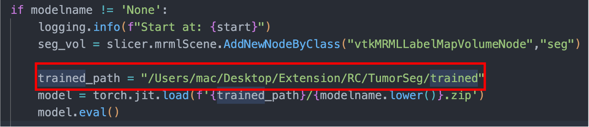
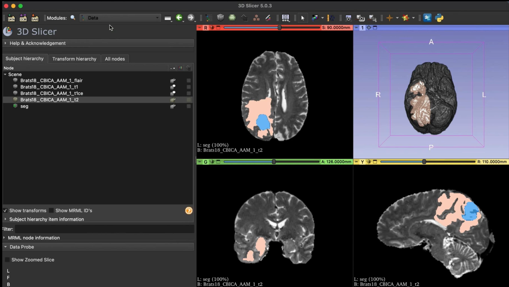

# Brain-Tumor-Segmentaion-on-3D-Slicer
### This is my demo app for my graduate thesis of topic: "Brain Tumor Detection by Deep Learning"

**I hope u enjoy this one! ⭐️**

## Introduction
In this thesis we was proposed 2 methode for 3D Brain Tumor Segmentation(BTS) problem.
- 3D Dual-Domain Attention Network: We was develop a module using Attention Mechanism can combine 2 level information of the feature... [Read more]()
- 3D Dual-Fusion Attention Network: We introduce a new way of fusion 2 trained model for BTS. Using fusion method, Self-Attention and Residual Learning. [Read more]()
  
## Demo Application
This repo is storage my demo app.

My app is an Extension of [3D Slicer](). So you need to installed this app first.
You also need all of trained models to using in my extention. [Download here](https://1drv.ms/f/s!ArlplJhiPYx6gj2mHxkUZl7HWs1z?e=UGHIQ4).

## How to install.
1. Clone this repository.
   ``` shell 
    ~ git clone https://github.com/RC-Sho0/Brain-Tumor-Segmentaion-on-3D-Slicer.git
   ```
2. Add extension into 3D Slicer.
   - Open 3D Slicer.
   - 3D Slicer -> Edit -> Application Setting -> Drag folder of repo into 'Additional module paths'
3. Add traied module into Extension.
   - Copy path of trained folder
   - Replace the path at the **"trained_path"** variable in the file TumorSeg.py

    


## How to use:
[](https://www.youtube.com/watch?v=GyhCeiEjsKw)
 
---
If you like that, please Star my repo 🌟
And if you want to support let follows my github 🎆

***Authorized by [Sho0](https://sonvth.vercel.app/about)***